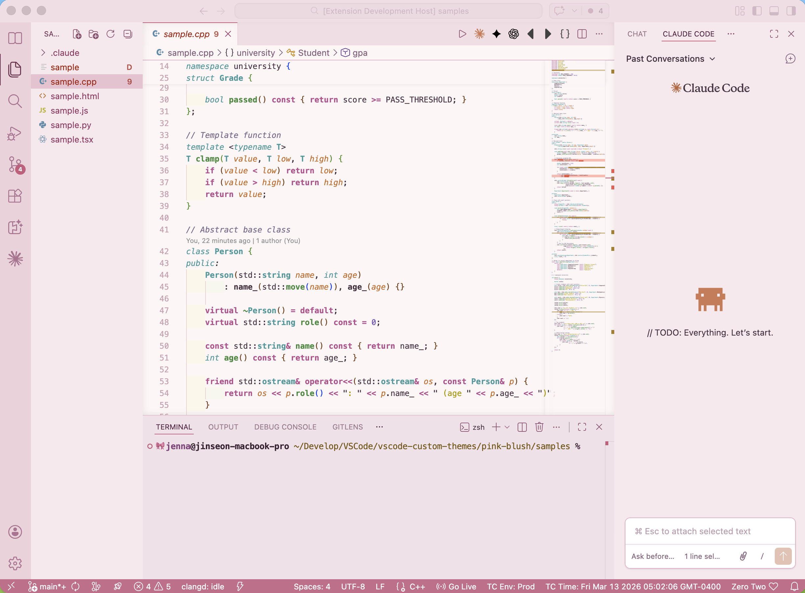
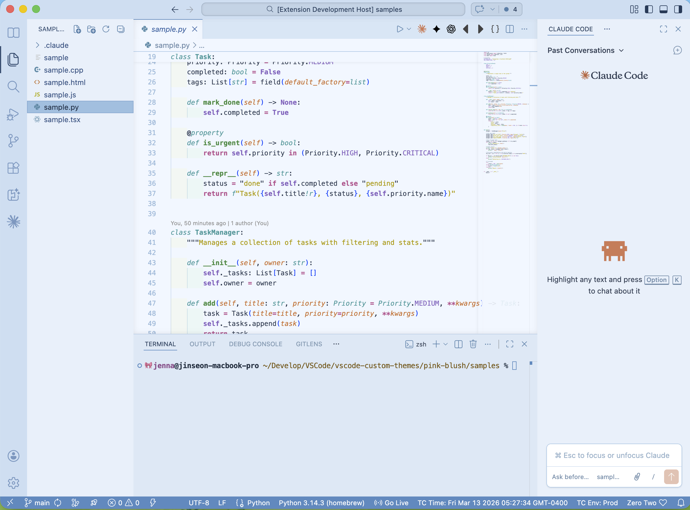

# VS Code Custom Themes

A collection of custom Visual Studio Code themes by [jenna-studio](https://github.com/jenna-studio).

---

## Pink Blush

A soft pastel pink light theme with Dracula-inspired syntax highlighting.



### Pink Blush Features

- Soft pink UI chrome (sidebar, tabs, activity bar, status bar)
- Dracula-inspired syntax colors adapted for a light background
- Bold keywords, functions, and class names for better readability
- Italic types and parameters
- Warm, vibrant terminal colors with a pink-tinted background
- Carefully tuned git decorations, bracket matching, and search highlights

### Pink Blush Color Palette

| Element | Color | Style |
| --- | --- | --- |
| Keywords | `#C54B8C` pink | bold |
| Functions | `#1A8C42` green | bold |
| Strings | `#B09B00` golden | |
| Numbers/Constants | `#7C4DBA` violet | |
| Types/Classes | `#0D9B9B` teal | italic / bold |
| Parameters | `#D66A2D` orange | italic |
| Comments | `#7E6B8A` muted plum | italic |

### Pink Blush Install

```bash
cd pink-blush
npx @vscode/vsce package
code --install-extension pink-blush-1.0.0.vsix
```

Then open the Command Palette (`Cmd+K Cmd+T`) and select **Pink Blush**.

---

## Skyblue Powder

A soft pastel sky blue light theme with Dracula-inspired syntax highlighting and diverse font weights.



### Skyblue Powder Features

- Soft sky blue UI chrome (sidebar, tabs, activity bar, status bar)
- Dracula-inspired syntax colors adapted for a light background
- Bold keywords, functions, and class names for better readability
- Italic types and parameters
- Cool-toned terminal colors with a blue-tinted background
- Carefully tuned git decorations, bracket matching, and search highlights

### Skyblue Powder Color Palette

| Element | Color | Style |
| --- | --- | --- |
| Keywords | `#C54B8C` pink | bold |
| Functions | `#1A8C42` green | bold |
| Strings | `#B09B00` golden | |
| Numbers/Constants | `#7C4DBA` violet | |
| Types/Classes | `#0D9B9B` teal | italic |
| Parameters | `#D66A2D` orange | italic |
| Comments | `#6A8BA0` muted blue | italic |

### Skyblue Powder Install

```bash
cd skyblue-powder
npx @vscode/vsce package
code --install-extension skyblue-powder-1.0.0.vsix
```

Then open the Command Palette (`Cmd+K Cmd+T`) and select **Skyblue Powder**.

---

## Install

Each theme is a standalone VS Code extension — install only the ones you want.

### From the Marketplace

Search for the theme name in the VS Code Extensions panel:

- **Pink Blush** — `jenna-studio.pink-blush`
- **Skyblue Powder** — `jenna-studio.skyblue-powder`

### From Source

```bash
git clone https://github.com/jenna-studio/vscode-custom-themes.git
cd vscode-custom-themes

# Install only the theme you want:
cd pink-blush        # or: cd skyblue-powder
npx @vscode/vsce package
code --install-extension *.vsix
```

Then open the Command Palette (`Cmd+K Cmd+T`) and select your theme.
